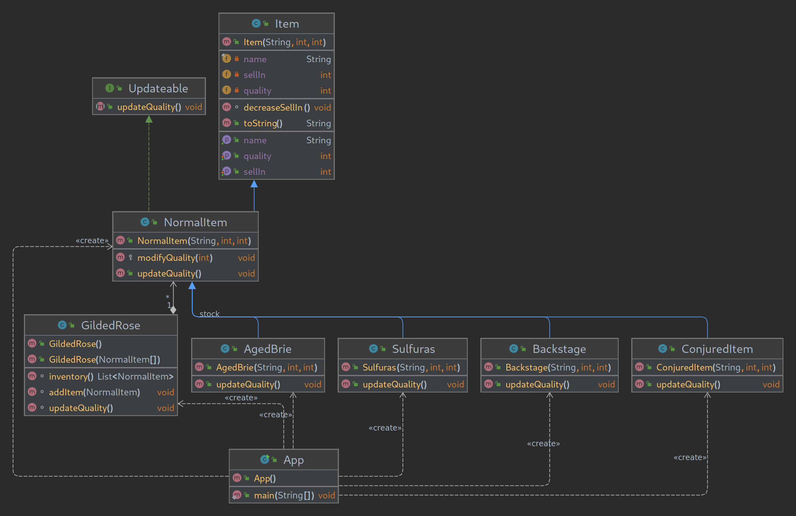

# Gilded Rose

## Ollivanders Shop. Kata Programación DAW Dual
La tienda Ollivanders necesita un programa para llevar el cálculo de calidad y caducidad de su inventario.  
Crea el programa con la ayuda del diagrama UML.  

The Ollivanders shop needs a program to calculate the quality and expiration of its inventory.  
Create the program with the help of the UML diagram.  

## Key-Concepts :dart: 
- ADT
- Inheritance
- Polymorphism
- Docker
- Java
- Python
- DDD

## UML

## Docker
Proyecto hecho en Python y Java.  

Ampliado el proyecto Java dockerizandolo con multistage, separando un contenedor con maven que crea el .jar de la aplicacion y luego otro contenedor que solo contiene el J2SE-11 y el .jar.  

Aqui podemos ver el build de la imagen del contenedor:  

---

Y aqui podemos ver la ejecucion:  
