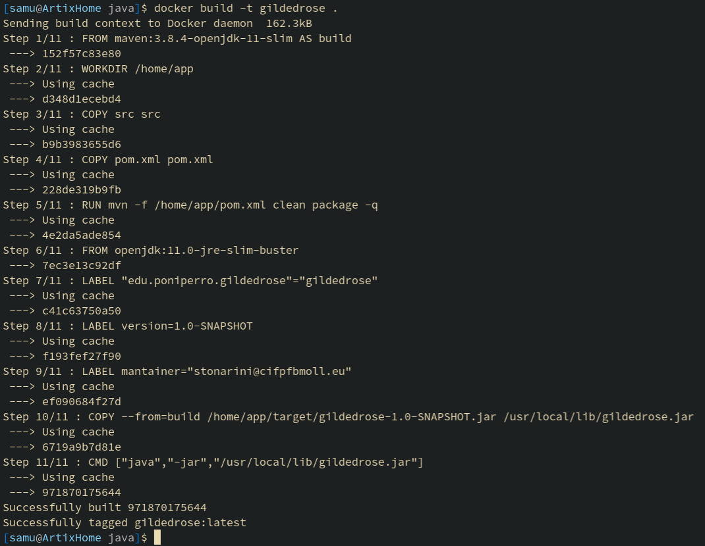
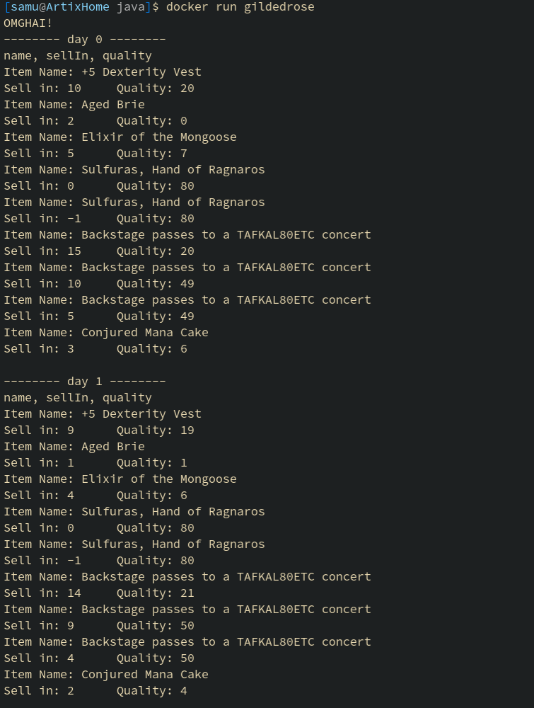

# GildedRose

Proyecto hecho en Python y Java.  

Ampliado el proyecto Java dockerizandolo con multistage, separando un contenedor con maven que crea el .jar de la aplicacion y luego otro contenedor que solo contiene el J2SE-11 y el .jar.

Aqui podemos ver el build de la imagen del contenedor:

---

Y aqui podemos ver la ejecucion:  
